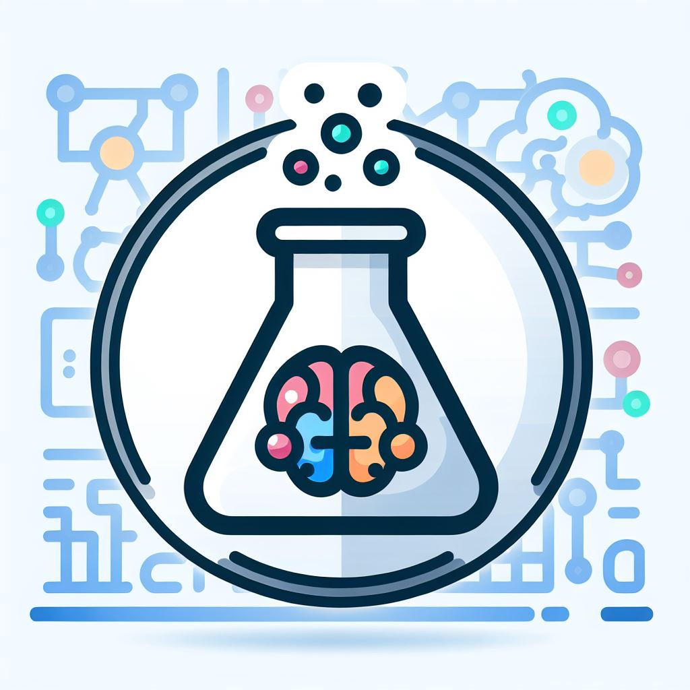

<h1 align="center">
     
    
     
    AI for Chemistry Starter Resources 
     
</h1>

<h4 align="center">Resources to support self-learning of AI for Chemistry.</h4>

    <a href="#overview">overview</a> •
    <a href="#foundation">ML foundation</a> •
    <a href="#chemistry">chemistry-specific tutorials</a> •
    <a href="#relevant-packages">relevant packages</a> •

 

## overview

This repo contains resources to guide self-learning of AI for chemical
applications. This is, by no means, a comprehensive list. Rather, this should
serve as a good starting point and overview for the types of applications of
AI in chemistry.

## ML foundation

<a href="https://d2l.ai/index.html">Dive into Deep Learning</a> -- online textbook on deep learning; includes code tutorials\\
<a href="https://predictivesciencelab.github.io/data-analytics-se/index.html#">Introduction to Scientific ML</a> -- online textbook with interactive coding tutorials\\
<a href="https://www.coursera.org/specializations/machine-learning-introduction">(Ng) ML introduction</a> -- online course with video component featuring ML basics\\

## Chemistry-specific resources

<a href="https://github.com/schwallergroup/ai4chem_course">EPFL AI for Chem</a> -- Course materials for Philip Schwaller's AI for Chemistry course\\
<a href="https://weisscharlesj.github.io/SciCompforChemists/notebooks/introduction/intro.html">Scientific coding for chemists</a> -- online textbook on programming for chemistry; features coding tutorials\\

## relevant software packages

### working with molecules and materials

<a href="https://www.rdkit.org/docs/Overview.html">RDKit</a> -- build and manipulate molecules\\
<a href="https://github.com/lukasturcani/stk">STK</a> -- build and manipulate supramolecular materials\\
<a href="https://github.com/JelfsMaterialsGroup/stko">STKO</a> -- optimize supramolecular materials\\

### ML packages

#### chemical representations

<a href="https://www.rdkit.org/docs/Overview.html">RDKit</a> -- molecular fingerprints\\
<a href="https://github.com/mordred-descriptor/mordred">MORDRED</a> -- molecular descriptors\\
<a href="https://singroup.github.io/dscribe/latest/tutorials/tutorials.html">DScribe</a> -- complex 3D molecular and material descriptors\\

#### models

<a href="https://scikit-learn.org/stable/user_guide.html">scikit-learn</a> -- ML models and metrics\\
<a href="https://pytorch.org/tutorials/">PyTorch</a> -- deep learning package\\
<a href="https://www.tensorflow.org/learn">Tensorflow</a> -- deep learning package\\
<a href="https://huggingface.co/docs/transformers/en/index">Hugging Face</a> -- LLMs\\
<a href="https://github.com/leojklarner/gauche">GAUCHE</a> -- Gaussian Processes for Chemistry\\
<a href="https://botorch.org/tutorials/">BOTorch</a> -- Bayesian optimization\\
<a href="https://emdgroup.github.io/baybe/stable/">BayBE</a> -- Bayesian optimization for chemistry\\

